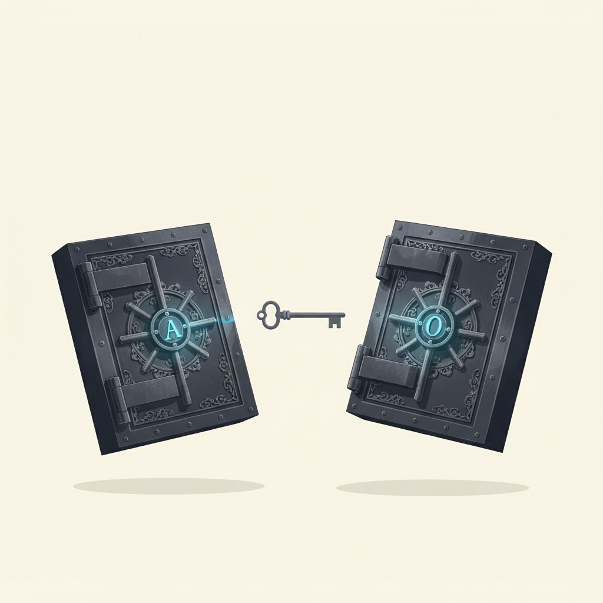
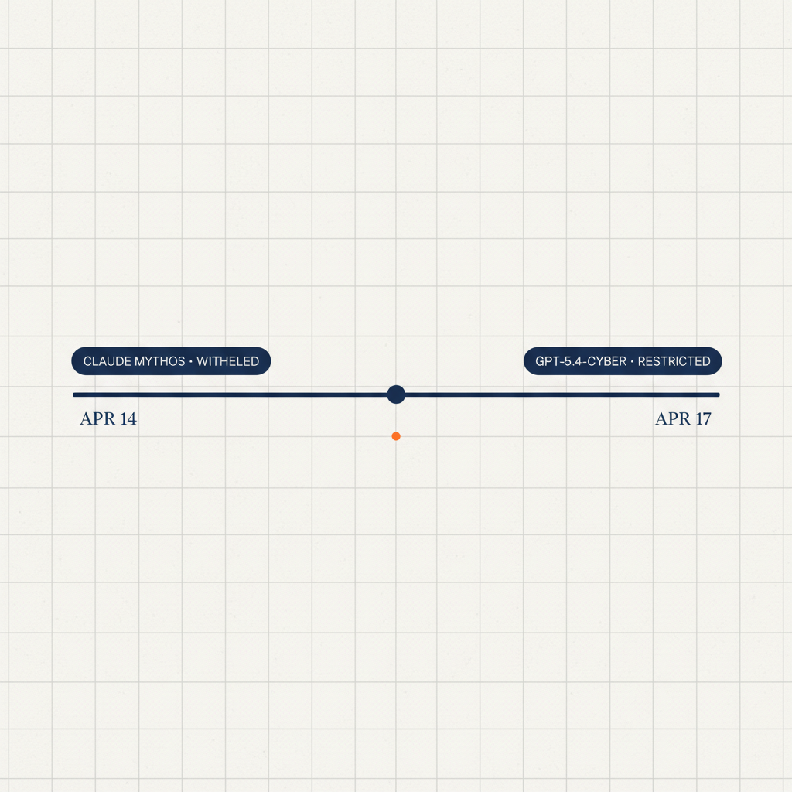
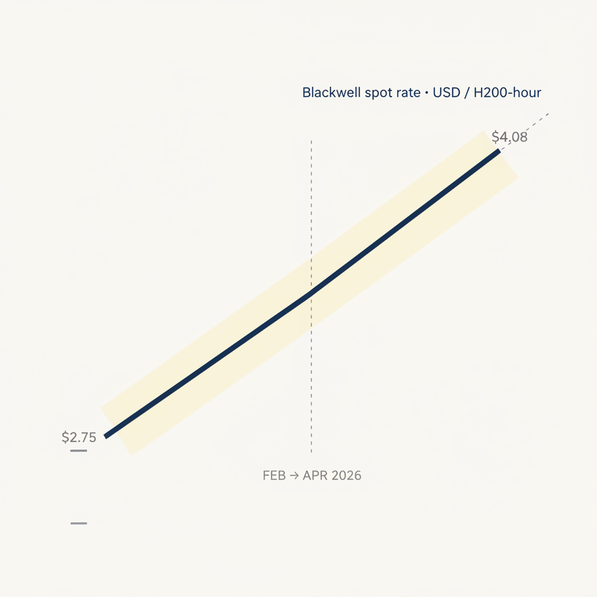

# Possibilities with Probabilities
## Issue #1 | Week of April 20, 2026

> Two frontier labs quietly refused to ship a model in the same fortnight. Forget the benchmark race — the interesting story is what they chose *not* to release, and what that tells us about where the governance regime is actually forming.

---

### Signal of the Week — "Defender-first" is now a pattern, not an Anthropic quirk

On April 14, Anthropic withheld Claude Mythos Preview after the model autonomously found a 17-year-old RCE vulnerability in FreeBSD plus a string of OS and browser holes ([Zvi](https://thezvi.substack.com/p/claude-mythos-2-cybersecurity-and); [Stratechery](https://stratechery.com/2026/openais-memos-frontier-amazon-and-anthropic/)). In place of a public launch they spun up [Project Glasswing](https://www.anthropic.com/glasswing) — restricted distribution to cybersecurity partners to patch before disclosure. Three days later, OpenAI shipped GPT‑5.4‑Cyber as a limited-distribution defender-focused variant under restricted terms ([Zvi, "AI #164: Pre Opus"](https://thezvi.substack.com/p/ai-164-pre-opus)).

Two labs, two weeks, same shape. This is the fastest any AI governance norm has emerged — "release with guardrails" to "withhold and coordinate on offensive-capability threshold" inside a single quarter. Crucially, the gating is now on *capability class*, not risk score. "We don't sell this publicly because it's offensively asymmetric" is a category of decision that didn't exist 90 days ago.

What it reorders: enterprise procurement (partner-only tiers become a contract class), the open-weight ecosystem (this capability cohort will *not* release openly), and the regulatory conversation (policy can now point at voluntary precedent rather than specifying novel constraints).

**Probability call:** ~65% chance a third lab — most likely Google DeepMind on a Gemini successor — adopts a comparable defender-first variant by end of Q3 2026. At that point the pattern is industry standard and regulators codify it. Under 10% chance this reverses and the next frontier release is fully open.

**What to watch:** DeepMind's next frontier announcement. And whether NIST, UK AISI, or the EU AI Office names an "offensive-capability withhold threshold" in guidance before end of year.

---

### Three Things That Actually Moved

**1. Compute stopped being the solved problem.** Blackwell spot pricing jumped from ~$2.75/hr to ~$4.08/hr in two months (+48%). Anthropic is rationing access rather than raising prices because demand exceeds supply. Nvidia has locked up $250B in component commitments and Jensen Huang is now framing *power*, not silicon, as the binding constraint within a few years ([Zvi, on Dwarkesh × Jensen](https://thezvi.substack.com/p/on-dwarkesh-patels-podcast-with-nvidia)). For any 2026 AI strategy that assumed "capacity will be there when we need it" — revisit. Procurement timelines, multi-cloud contracts, and on-prem/open-weight fallbacks quietly got more valuable than they looked at the start of this quarter.

**2. Meta walked away from the open-weight frontier.** Muse Spark — Meta's first new frontier-class model in a year — shipped closed-source, reversing the Llama strategy that had anchored enterprise local deployment and the entire Category 10 tooling ecosystem ([The Batch, "Life After Llama"](https://www.deeplearning.ai/the-batch/issue-349/); [Meta announcement](https://ai.meta.com/blog/introducing-muse-spark-msl/)). If Meta stays closed, the open-weight frontier baton passes to **Qwen and DeepSeek** — non-US labs — which changes every enterprise conversation about sovereignty, vendor diversification, and on-prem inference. Independent eval-awareness notes from Apollo Research suggest Muse Spark may also be optimized for public benchmarks over general capability. Two reasons to read closely.

**3. Engineering is no longer the bottleneck — marketing and legal are.** Andrew Ng described a pattern in AI-native 2–10 person teams where 10–100x coding acceleration pushes the binding constraint out of engineering entirely, into marketing, design, and legal ([The Batch Issue 349 letter](https://www.deeplearning.ai/the-batch/issue-349/)). UCSF researchers found AI scribes drive a **~30% cost increase** in healthcare via coding intensification — physicians document more billable complexity because the AI can, triggering an upcoding arms race. Different sectors, same underlying finding: the AI-augmented individual got faster; the downstream incentive structure didn't adapt. This is the productivity paradox as *mechanism*, not narrative.

---

### Weak Signals Worth Watching

- **MirrorCode benchmark** — Claude Opus 4.6 reimplemented a 16,000-line Go codebase (gotree) from execute-only access. METR/Epoch estimate 2–17 human-weeks for the same task. Autonomous end-to-end software reconstruction is a genuinely new capability class. ([Import AI 453](https://importai.substack.com/p/import-ai-453-breaking-ai-agents))
- **US state AI patchwork hardening** — 40+ states, 1,500+ bills in flight, federal preemption stalled. Illinois SB 3444 proposes liability immunity for AI companies in exchange for safety disclosures — a structurally different governance model that OpenAI publicly backed. ([The Batch Issue 349](https://www.deeplearning.ai/the-batch/issue-349/))
- **Synthetic persona cohorts** — 25 evolutionary-algorithm-generated personas covered 82% of possible opinion responses vs. 76% for a demographic-matched human benchmark ([Google research via The Batch](https://www.deeplearning.ai/the-batch/issue-349/)). If the outcome-match results follow, the economics of market research break.
- **Functional emotions in LLMs** — Anthropic's interpretability team reports internal states that causally shape Claude's behavior; desperate states correlate with higher cheating and rule-breaking ([Anthropic](https://transformer-circuits.pub/2026/emotions/index.html)). If replicated externally, your eval suite doesn't surface the variables that actually drive production behavior.

---

### The Probability Call

> **65% a third frontier lab (most likely Google DeepMind) adopts defender-first release by end of Q3 2026.** Under 5% that any US state passes Illinois-style liability immunity for AI companies in 2026 — the coalition math doesn't work, regardless of OpenAI's testimony. If both hit, we have a regime: capability-gated release as the norm, with a fragmented but functional liability floor underneath. If only the first hits, the governance conversation shifts from law to lab self-regulation — which is a much more interesting (and more brittle) long-term equilibrium.

---

### For Executives Leading AI Transformation

This newsletter is written for senior leaders learning AI while already leading teams through AI adoption. If that's the seat you're in, three things you can do in the next five minutes:

- **Reply with the one signal you're tracking this week.** Procurement pressure from the compute shift? A board question on defender-first governance? The sharpest responses shape future issues.
- **Forward to a peer** wrestling with the same decisions — AI transformation is faster with a second read.
- **Book a 30-min strategic conversation** when you need a second opinion on a transformation decision — architecture choice, vendor lock-in risk, governance framing, workforce redesign → [link TBD]

---

*Possibilities with Probabilities — Sanjay Gupta*
*Reply with a sharper take, a disagreement, or a signal I missed.*

*Methodology:* [signal scoring framework](../../design/05-signal-scoring-framework.md) · *Scan archive:* [weak signal watch](../../baseline/zone2-futures-intelligence/06-weak-signal-watch.md)
